# Retail Intelligence Studio

A multi-agent AI system for retail decision intelligence, built with .NET Aspire and Microsoft Agent Framework. The system orchestrates specialized AI agents to analyze business decisions from multiple perspectives, providing comprehensive insights for retail executives.


## 🎯 Overview

Retail Intelligence Studio uses a **fan-out/fan-in orchestration pattern** to evaluate business decisions through 8 specialized intelligence agents. Each agent analyzes the decision from a unique perspective, and the results are synthesized into an executive recommendation.

### Key Features

- **Multi-Agent Architecture**: 8 specialized AI agents working in concert
- **Parallel Execution**: 6 analysis agents run concurrently for fast insights
- **Real-time Streaming**: Server-Sent Events (SSE) for live progress updates
- **Persona-Based Context**: Tailored analysis for different retail segments
- **Observable**: Full OpenTelemetry integration with Aspire Dashboard

## 🏗️ Architecture

### Agent Workflow

```mermaid
flowchart TB
    subgraph Input
        U[User Decision Request]
        P[Persona Context]
    end

    subgraph "Stage 1: Framing"
        DF[🎯 Decision Framer]
    end

    subgraph "Stage 2: Parallel Analysis"
        SI[👥 Shopper Insights]
        DEM[📈 Demand Forecasting]
        INV[📦 Inventory Readiness]
        MAR[💰 Margin Impact]
        DIG[🛒 Digital Merchandising]
        RSK[⚠️ Risk & Compliance]
    end

    subgraph "Stage 3: Synthesis"
        EXE[🏆 Executive Recommendation]
    end

    subgraph Output
        REC[Final Recommendation]
        INS[Role Insights]
    end

    U --> DF
    P --> DF
    
    DF --> SI
    DF --> DEM
    DF --> INV
    DF --> MAR
    DF --> DIG
    DF --> RSK
    
    SI --> EXE
    DEM --> EXE
    INV --> EXE
    MAR --> EXE
    DIG --> EXE
    RSK --> EXE
    
    EXE --> REC
    EXE --> INS

    style DF fill:#e1f5fe
    style SI fill:#fff3e0
    style DEM fill:#fff3e0
    style INV fill:#fff3e0
    style MAR fill:#fff3e0
    style DIG fill:#fff3e0
    style RSK fill:#fff3e0
    style EXE fill:#e8f5e9
```



### Orchestration Flow


## 🤖 Intelligence Agents

### Stage 1: Decision Framing

| Agent | Purpose | Output |
|-------|---------|--------|
| **🎯 Decision Framer** | Clarifies the business question and produces a structured Decision Brief. Identifies the core question, proposed action, scope, and key assumptions. | Decision Brief |

### Stage 2: Parallel Analysis

| Agent | Purpose | Focus Areas |
|-------|---------|-------------|
| **👥 Shopper Insights** | Analyzes customer behavior, preferences, and potential reactions to the proposed decision. | Customer Segments, Purchase Patterns, Price Sensitivity, Brand Loyalty |
| **📈 Demand Forecasting** | Projects demand impact and volume changes resulting from the decision. | Volume Projections, Seasonality, Trend Analysis, Cannibalization |
| **📦 Inventory Readiness** | Evaluates supply chain and inventory implications. | Stock Levels, Lead Times, Supplier Capacity, Distribution |
| **💰 Margin Impact** | Calculates financial implications including margin, revenue, and profitability. | Gross Margin, Revenue Impact, Cost Analysis, ROI |
| **🛒 Digital Merchandising** | Assesses e-commerce and digital channel considerations. | Online Conversion, Search Visibility, Digital Placement, Omnichannel |
| **⚠️ Risk & Compliance** | Identifies risks, regulatory concerns, and potential compliance issues. | Regulatory Risk, Brand Risk, Operational Risk, Mitigation Strategies |

### Stage 3: Synthesis

| Agent | Purpose | Output |
|-------|---------|--------|
| **🏆 Executive Recommendation** | Synthesizes all analysis perspectives into a final recommendation with confidence score, key factors, and action items. | Executive Summary with Verdict (PROCEED / PROCEED WITH CAUTION / DO NOT PROCEED) |

## 🚀 Getting Started

### Prerequisites

- [.NET 10 SDK](https://dotnet.microsoft.com/download)
- [Node.js 20+](https://nodejs.org/)
- [Docker Desktop](https://www.docker.com/products/docker-desktop/) (optional, for containerized deployment)
- [Azure CLI](https://docs.microsoft.com/cli/azure/install-azure-cli) (optional, for Azure OpenAI with Entra ID authentication)

### Running Locally

1. **Clone the repository**
   ```bash
   git clone https://github.com/yourusername/retail-intelligence-studio.git
   cd retail-intelligence-studio
   ```

2. **Trust the development certificate** (first time only)
   ```bash
   dotnet dev-certs https --trust
   ```

3. **Start the application**
   ```bash
   dotnet run --project RetailIntelligenceStudio.AppHost
   ```

4. **Open the application**
   - **Aspire Dashboard**: https://localhost:17204 (login token shown in console)
   - **Frontend**: The URL will be shown in the Aspire Dashboard

> **Note**: Without Azure OpenAI configuration, the application runs with local mock agents that return simulated responses. This is great for UI development and testing the workflow.

### Configuration

## 🔐 Azure OpenAI Setup

The application supports two authentication methods for Azure OpenAI:

### Option 1: API Key Authentication (Simplest)

1. **Get your Azure OpenAI credentials** from the [Azure Portal](https://portal.azure.com):
   - Navigate to your Azure OpenAI resource
   - Go to **Keys and Endpoint**
   - Copy the **Endpoint** and one of the **Keys**

2. **Configure the application** - Create or edit `RetailIntelligenceStudio.Server/appsettings.Development.json`:

   ```json
   {
     "AzureOpenAI": {
       "Endpoint": "https://your-resource.openai.azure.com/",
       "DeploymentName": "gpt-4o",
       "ApiKey": "your-api-key-here"
     }
   }
   ```

   > ⚠️ **Security Note**: Never commit API keys to source control. The `appsettings.Development.json` file is included in `.gitignore`.

3. **Alternative: Use environment variables**:
   ```bash
   # PowerShell
   $env:AzureOpenAI__Endpoint = "https://your-resource.openai.azure.com/"
   $env:AzureOpenAI__DeploymentName = "gpt-4o"
   $env:AzureOpenAI__ApiKey = "your-api-key-here"
   
   # Bash
   export AzureOpenAI__Endpoint="https://your-resource.openai.azure.com/"
   export AzureOpenAI__DeploymentName="gpt-4o"
   export AzureOpenAI__ApiKey="your-api-key-here"
   ```

### Option 2: Entra ID Authentication (Recommended for Production)

This method uses `DefaultAzureCredential` which supports multiple authentication flows including Azure CLI, Visual Studio, and managed identities.

1. **Login to Azure CLI**:
   ```bash
   az login
   ```

2. **Ensure you have the required RBAC role** on your Azure OpenAI resource:
   - Role: **Cognitive Services OpenAI User** (or Contributor)
   - Assign via Azure Portal or CLI:
     ```bash
     az role assignment create \
       --role "Cognitive Services OpenAI User" \
       --assignee your-email@domain.com \
       --scope /subscriptions/{subscription-id}/resourceGroups/{resource-group}/providers/Microsoft.CognitiveServices/accounts/{openai-resource-name}
     ```

3. **Configure the endpoint** (no API key needed):
   ```json
   {
     "AzureOpenAI": {
       "Endpoint": "https://your-resource.openai.azure.com/",
       "DeploymentName": "gpt-4o"
     }
   }
   ```

### Azure OpenAI Requirements

| Requirement | Details |
|-------------|---------|
| **Model Deployment** | You need a deployed model (e.g., `gpt-4o`, `gpt-4`, `gpt-35-turbo`) in your Azure OpenAI resource |
| **API Version** | The application uses the latest Azure OpenAI SDK which handles API versioning automatically |
| **Region** | Ensure your Azure OpenAI resource is in a region that supports your chosen model |

### Troubleshooting

| Error | Cause | Solution |
|-------|-------|----------|
| `400 BadRequest` | Invalid endpoint, missing deployment, or auth failure | Verify endpoint URL and deployment name exist |
| `401 Unauthorized` | Invalid API key or missing RBAC permissions | Check API key or run `az login` and verify RBAC role |
| `403 Forbidden` | Subscription/resource access denied | Verify your account has access to the Azure OpenAI resource |
| `404 NotFound` | Deployment name doesn't exist | Verify the model deployment name in Azure Portal |
| `DefaultAzureCredential` error | Not logged into Azure CLI | Run `az login` to authenticate |

### Configuration Reference

| Setting | Environment Variable | Description | Required |
|---------|---------------------|-------------|----------|
| `AzureOpenAI:Endpoint` | `AzureOpenAI__Endpoint` | Azure OpenAI endpoint URL | Yes |
| `AzureOpenAI:DeploymentName` | `AzureOpenAI__DeploymentName` | Model deployment name | No (default: `gpt-4o`) |
| `AzureOpenAI:ApiKey` | `AzureOpenAI__ApiKey` | API key for authentication | No (uses Entra ID if not set) |

## 📁 Project Structure

```
retail-intelligence-studio/
├── RetailIntelligenceStudio.AppHost/     # Aspire orchestration host
├── RetailIntelligenceStudio.ServiceDefaults/  # Shared service configuration
├── RetailIntelligenceStudio.Server/      # ASP.NET Core API backend
├── RetailIntelligenceStudio.Core/        # Domain models and abstractions
├── RetailIntelligenceStudio.Agents/      # Intelligence agents and orchestration
│   ├── Roles/                            # Individual agent implementations
│   ├── Orchestration/                    # Workflow orchestrator
│   └── Infrastructure/                   # Agent factories and clients
├── RetailIntelligenceStudio.Tests/       # Unit and integration tests
└── frontend/                             # React 19 + Vite frontend
```

## 🔭 Observability

The application includes full OpenTelemetry instrumentation:

- **Traces**: Distributed tracing across all agent executions
- **Metrics**: Runtime and HTTP metrics
- **Structured Logs**: Rich logging with emoji prefixes for easy scanning

View all telemetry in the Aspire Dashboard at https://localhost:17204.

## 🧪 Testing

Run all tests:
```bash
dotnet test
```

Run specific test categories:
```bash
dotnet test --filter "OpenTelemetryLoggingTests"
```

## 🛠️ Technology Stack

| Layer | Technology |
|-------|------------|
| **Orchestration** | .NET Aspire 13.1 |
| **Backend** | ASP.NET Core 10 |
| **AI Framework** | Microsoft Agent Framework |
| **Frontend** | React 19, Vite 6, TailwindCSS |
| **Observability** | OpenTelemetry, Aspire Dashboard |
| **AI Provider** | Azure OpenAI (or local mock) |

## 📄 License

This project is licensed under the MIT License - see the [LICENSE](LICENSE) file for details.

## 🤝 Contributing

Contributions are welcome! Please feel free to submit a Pull Request.

1. Fork the repository
2. Create your feature branch (`git checkout -b feature/amazing-feature`)
3. Commit your changes (`git commit -m 'Add some amazing feature'`)
4. Push to the branch (`git push origin feature/amazing-feature`)
5. Open a Pull Request
